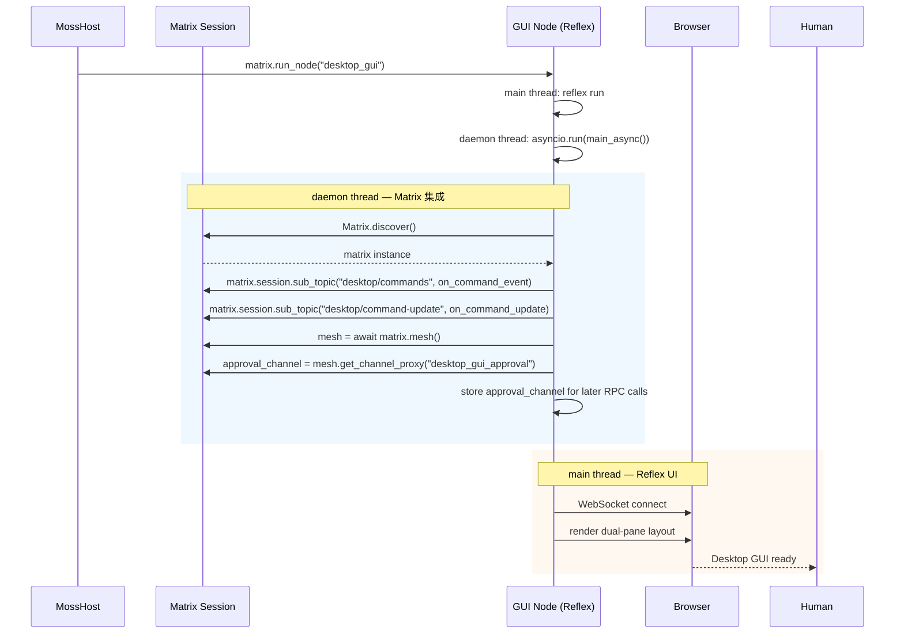
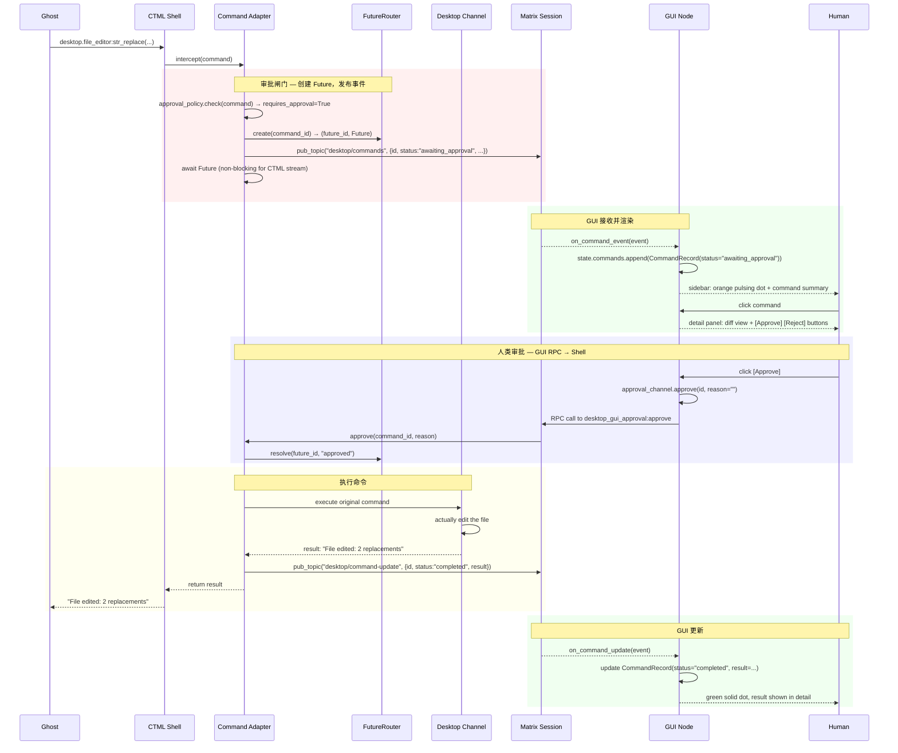
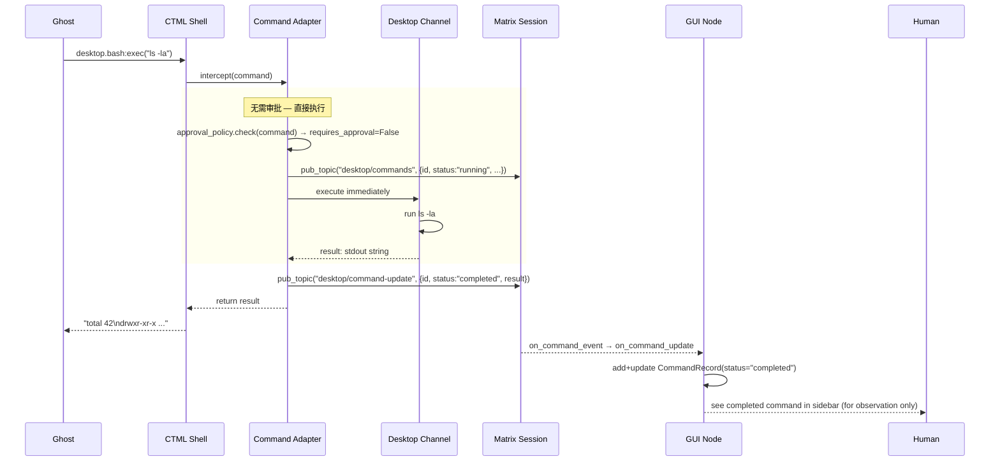
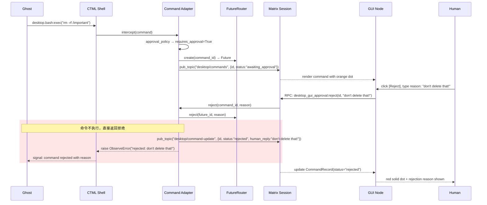
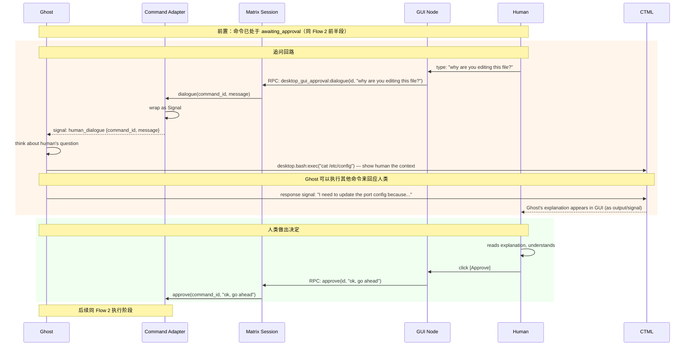
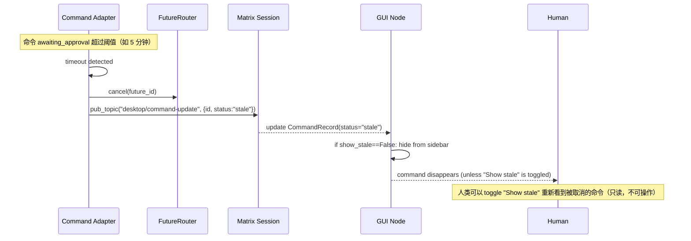

# 2026-07-23 Desktop GUI 时序流程

## 上下文

在重做数据结构之前，先把核心交互流程画清楚。参与角色：

| 角色 | 进程 | 说明 |
|------|------|------|
| Ghost | Shell 进程 | AI 模型，通过 CTML 调用 desktop channel 命令 |
| CTML Shell | Shell 进程 | 解析 CTML，执行命令 |
| Desktop Channel | Shell 进程 | bash + file_editor 的实际实现 |
| Command Adapter | Shell 进程 | 拦截层——审批闸门，Future 管理，Matrix 事件发布 |
| FutureRouter | Shell 进程 | 进程内 Future 路由 |
| Matrix Session | 网络 | IPC 总线 |
| GUI Node | GUI 进程 | Reflex web server，人类的观察与审批窗口 |
| Human | 浏览器 | 人类用户 |

关键约束：
- Ghost **不知道** GUI 的存在——它只用 `desktop.bash:exec` 等标准命令
- Command Adapter 是 Shell 进程内的透明拦截层
- GUI → Shell 的审批反馈走 Matrix Channel RPC（Shell 暴露 `desktop_gui_approval` channel，GUI 获取 proxy 调用）

---

## Flow 1: GUI Node 启动



要点：
- daemon 线程跑 Matrix asyncio，主线程跑 Reflex
- GUI 订阅两个 topic：`desktop/commands`（新命令）和 `desktop/command-update`（状态变更）
- GUI 获取 `desktop_gui_approval` channel 的 proxy，用于后续审批 RPC
- 线程间通过 `asyncio.Queue` 或直接操作 Reflex State（线程安全）来传递事件

---

## Flow 2: 命令需要审批（happy path）

Ghost 执行 `desktop.file_editor:str_replace(path="/etc/config", old_str="...", new_str="...")`，
Adapter 判定需要审批。



要点：
- Adapter 在 `await Future` 时不阻塞 CTML 流——其他 channel 的命令继续执行
- Ghost 的体验：调用了 `desktop.file_editor:str_replace`，等了一会儿，拿到结果。不知道审批发生过
- 审批决策通过 Matrix Channel RPC 从 GUI 传回 Shell

---

## Flow 3: 命令无需审批（auto-pass）

Ghost 执行 `desktop.bash:exec("ls -la")`，Adapter 判定无需审批，直接执行。



要点：
- 无需审批时，命令直接执行，但仍然发布到 topic 供 GUI 展示
- Human 看到命令在 sidebar 中出现并快速完成（绿色灯）
- 这是"观察"而非"审批"——人类只看到 Ghost 做了什么

---

## Flow 4: 人类拒绝



要点：
- 命令**从未执行**——Adapter 在 Future 被 reject 后直接返回错误
- Ghost 收到的是 `ObserveError`（信号），不是普通返回值——Ghost 可以决定怎么回应
- Ghost 可以解释原因（通过下一轮 CTML），这就是审批即对话

---

## Flow 5: 人类追问（审批即对话）



要点：
- 追问不改变命令的 `awaiting_approval` 状态——它仍然是 pending
- Ghost 在等待期间可以继续执行其他 CTML 命令来解释和回应
- 这实现了"审批即对话"——不是 yes/no 的二元闸门，而是人类与 Ghost 在 desktop 知觉空间中的协作对话
- 追问消息本身不是 command，是 signal——它不阻塞任何 channel 的 FIFO

---

## Flow 6: 超时 / Stale



---

## 对数据结构设计的启示

从这些流程中，命令的生命周期状态机可以确定为：

```
pending → running → (awaiting_approval) → approved → completed
                    ↓                    ↓
                    stale               rejected → (stale after timeout)
                                        ↓
                                       error
```

其中 `awaiting_approval` 是可选的——取决于 approval_policy。

### 关键实体分离

画完图后，可以清楚看到三种实体：

1. **CommandInvocation** — Ghost 发出的命令本身
   - 包含：id, channel_path, command_name, params, status, result
   - 生命周期：贯穿整个流程

2. **ApprovalRequest** — 审批闸门（可选，只有需要审批的命令才有）
   - 包含：command_id, future_id, prompt, status (pending/approved/rejected/stale)
   - 生命周期：从 `awaiting_approval` 到 `approved`/`rejected`/`stale`

3. **DialogueMessage** — 追问消息（可选）
   - 包含：command_id, sender (human/ghost), message, timestamp
   - 关联到审批请求，但不改变审批状态

前两种实体是 1:0..1 的关系，第三种是 1:N 的关系。

### 线程与通信模型

```
Shell 进程                         GUI 进程
┌──────────────────┐              ┌──────────────────────┐
│  Desktop Channel │              │  Reflex (main thread)│
│       ↓          │              │        ↑             │
│  Command Adapter │──Matrix────▶│  DesktopState        │
│       ↓          │  topic       │        ↓             │
│  FutureRouter    │              │  Sidebar + Detail    │
│       ↑          │              │        ↓             │
│  desktop_gui_    │◀──Matrix────│  Human clicks        │
│  approval chan   │  RPC         │  (approve/reject/    │
│                  │              │   dialogue)          │
└──────────────────┘              └──────────────────────┘
```

- Shell → GUI：Matrix topic（命令事件广播）
- GUI → Shell：Matrix Channel RPC（审批反馈）
- GUI 内部：daemon 线程 Matrix asyncio ↔ Reflex State（asyncio.Queue 或直接写入）

当前记录者视角：

画完这六个流程后，数据结构的设计方向变得清晰了。核心洞察：

1. `CommandRecord` 不应该是一个"万能 record"——它需要分成 `CommandInvocation` 和 `ApprovalRequest`
2. 审批是可选的——大部分 `desktop.bash:exec("ls")` 不需要审批，不需要创建 ApprovalRequest
3. 追问是一个独立的消息线程——不是 command，不是 approval decision，是对话
4. 现有的 `FutureRouter` 完美匹配"创建 Future → 等待 → resolve/reject"的模式，不需要重新发明
5. GUI Node 只需要持有 `desktop_gui_approval` channel 的 proxy，通过 RPC 回传审批结果——这比 pub/sub 更清晰
