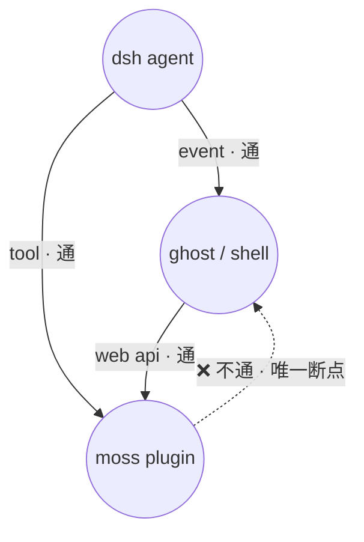
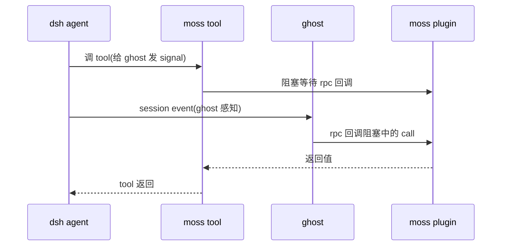

# dsh agent 状态机制与上下文建模

> 源码锚定、可回放、非推测。源码路径均相对 `research/source/deepseek-harness/`。
> 本次记录以「问题（原话）→ 探索路径 → 当前结论」组织，六问分六段。

---

## 一、session event 里除了 final answer 是否还有别的状态符号

> 「它的 session event 里有 final answer, 是否还有别的状态符号」

### 探索路径

- `SessionEventMap`：`packages/core/session/src/types.ts:236`+
- `TurnEndReasonMap`：`session/src/types.ts:155-177`
- `RequestHeaderReason`：`session/src/types.ts:228`
- Agent live events：`agent/src/runtime-types.ts:146-291`

### 当前结论

session event 是**完整状态机符号集**，非「输入→final answer」两点。转移符号核心：

- `TurnEndReason`（turn 为何结束，可扩展 union）：`completed` / `aborted` / `blocked` / `error` / `max-tokens` / `interrupted`
- `RequestHeaderReason`（为何发起请求）：`initial` / `resume`（标记 fork/resume）/ `change`

阶段边界：`turn/start·end`、`step/start·end`。内容符号：`user/message`（`source` 区分人类 prompt / `agent.inject()` / goal continuation）、`assistant/chunk`→`assistant/message`（final answer）、`tool/call·result`、`todo/write`。agent 内存层另有 `agent/status`（`idle`⇄`running`，每次转移都 emit）、`agent/inbox/*`、`agent/pre-step`、`agent/error`。

---

## 二、agent.inject 的级别与 steer 语义

> 「这里的 agent inject 是什么级别的? 是 session (与外部交互的主会话), 还是 subagent的? 看起来是 session 级别的, 其中 steer 什么意思我不太了解.」

### 探索路径

- `inject/steer/followup/send` 实现：`agent-loop/src/agent.ts:113-132`
- subagent 独立 session：`subagent/subagent/src/child-agent.ts`（`childSessionMeta`、`childSession.append`、独立 `sessionId`）
- `steer` 语义补充：`agent/src/runtime-types.ts:126-133`、`agent/turn-stopping` 事件 `:270-278`

### 当前结论

- `inject/steer/followup/send` 都是 `Agent` 接口方法，**per-agent**（每个 agent——主会话或 subagent——都持独立 session，inject/steer 绑定在各自 agent 上）。subagent 经 `ctx.agents.create()` 创建，是标准 `Agent`，继承同款方法。
- 四方法汇于一个 `send(input, target, wakeup)`，差别只在 target + wakeup：
  - `inject` → `next-step`, `wakeup=false`（**喂背景，不唤醒**）
  - `steer` → `next-step`, `wakeup=true`（**拧方向**，让本 turn 续跑/转向）
  - `followup` → `next-turn`, `wakeup=true`（开新 turn）
  - `send` → 通用
- `steer` 的语义是「给正在跑的活动拧方向」，不是开新任务；`agent/turn-stopping` 时 listener 可 `steer` 让 machine 多跑一步。

---

## 三、ContextForm 六分类的名字与用法

> 「ContextForm 看起来和 moss 高度对齐, 但我要知道每个分类的名字与用法」

### 探索路径

- `ContextForm` 定义：`llm/llm/src/message.ts:48-94`
- 生产者例证：`skill/tool-skill/src/index.ts:36,196,273,306`（catalog/instructions）、`skill/skill/src/index.ts:152`（instructions）、`agent-loop/src/runtime-context.ts:73`（snapshot）
- `MessageSource` kind 全集：`message.ts:100-126`

### 当前结论

ContextForm 是 producer 在 `source` 上声明的**内容语义标签**（consumer 决定视觉），六个：

| form | 语义 | 必需字段 | 生产者例证 |
|------|------|:---:|------|
| `instructions` | 工作区文件读出的、模型应遵循的指令 | — | skill 内容（`skill-invocation`）、subdir AGENTS.md |
| `catalog` | 本会话可用项目目录，变化时重发布 | — | `dsh-tool-skill` 的 skill 列表 |
| `snapshot` | 当前状态，后一快照取代前一 | `sections: [{name,text}]` | `runtime-context.ts` 命名分节快照 |
| `notice` | 刚发生的某事一次性说明；不取代任何东西 | `summary` | file-change、cron |
| `relay` | 另一 agent 发给本 agent 的消息 | — | 跨 agent 通讯 |
| `recall` | 从另一 session 日志提炼的素材（可精简） | — | 无内置 producer（dsh 留白，接近 MOSS Memento 回放位） |

`MessageSource.kind`（`message.ts:100-104`，merge-extensible）回答「谁产生」：`user` / `plugin`（动态上下文载体，`& ContextFormed`）/ `model` / `tool`，skill 等包可 merge 加 kind。

---

## 四、六 form 在 dsh 上下文里的位置（对比 MOSS ChannelMeta）

> 「告诉我这六个 form 在 dsh 上下文里大概是什么位置」（背景：对比 `core/concepts/channel.py:67` 起的 ChannelMeta）

### 探索路径

- MOSS `ChannelMeta`：`src/ghoshell_moss/core/concepts/channel.py:67-108`（instruction/context/help/memory + `dynamic`）
- dsh 上下文组装：`system-prompt/index.ts:42-120`（`PromptSection` 静态 / `PromptContext` 动态）、`agent-loop/src/agent.ts:230-240`
- 静态/动态切分：`request/header`（log-only）vs pre-step inject

### 当前结论

- **两坐标系正交**：MOSS 槽位（instruction/context/help/memory）是「上下文在 prompt 里的位置」；dsh form 是「producer 声明的内容语义」。
- dsh 六 form 分属两个维度：
  - **静态声明式**（进 system prompt）：`instructions`→sections、`catalog`→tools 目录、`snapshot`→contexts（动态段）
  - **动态运行时**（pre-step inject）：`notice` / `recall` / `relay`
- 对照 MOSS：`instruction`→`instructions`；`help`（warm data）→`catalog`；`context`→`snapshot`+`notice`+`relay`+`recall`；`memory`→`recall`。

---

## 五、snapshot+notice+relay+recall 是否都不进 session 历史

> 「snapshot + notice + relay + recall 这四个都是动态内容吗? 确认它们不进 session 历史数据」

### 探索路径

- `user/message` append（带 `surfaceOp:'append'`）：`agent-loop/src/agent.ts:282-284`
- `deriveEventMessage`（user/message → `return event.data`）：`session/src/surface.ts:83-113`
- surfaceOp 强制：`surface.ts:185-198`
- `inject` 实现 → inbox splice → `agent/inbox/spliced`：`agent-loop/src/agent.ts:113-132`、`agent/src/inbox.ts:186`

### 当前结论

**都不是「不进历史」的动态内容。** 所有动态上下文——inject 的 notice/recall/relay **和** runtime-context 的 snapshot——都以 `user/message` + `surfaceOp:'append'` **进 derived history**（`surface.ts:96` 直接 `return event.data`，verbatim）。surface-eligible 事件的 surfaceOp 被强制必带，**不存在「不 append 的 user/message」**。dsh **没有「不进历史」的动态上下文通道**。

---

## 六、project 是否只是「变更就进历史」，有无每轮更新不进历史的特殊槽位

> 「project 剥开这些单词, 它仍然是『变更就进历史上下文』的机制. 它实际上没有每轮更新都不进历史上下文的特殊槽位, 我判断对吗?」

### 探索路径

- `runtime-context.project`：`agent-loop/src/runtime-context.ts:64-75`（仅在文本变化时产出；`retained.seq` 记录）
- 可替换/失效机制：`runtime-context.ts:50-54`（`isReplacementSurfaceEvent` + `sourceEventSeqs`）、`surface.ts` 的 replace
- 静态 sections 去向：`session/src/types.ts:197`（request/header log-only）、`system-prompt/index.ts:251`（`renderContextSections` 取的是动态 contexts，非静态 sections）

### 当前结论

- **判断成立**：`project` 剥开 latest-wins / 可替换，本质是「内容变化才 append 一条 user/message 进历史」。它只有「变更才写」的节流，**没有「每轮注入但永不落历史」的槽位**。可替换只是事后管理（用 `plugin` 身份 + compaction `replace` 清旧 seq），管理的是已进过历史的消息。
- **唯一例外（非动态）**：静态 `PromptSection` 渲染成完整 system prompt 存进 `request/header`，log-only latest snapshot，**不进消息历史**（`types.ts:197`「outside derived history」）。但它是**声明式静态**的，不是每轮动态变化。
- **总结论**：dsh 没有「每轮动态更新、永不进历史」的第三类槽位。动态上下文（snapshot 与 inject 的 notice/recall/relay）都进历史；唯一不进消息历史的是静态声明式 sections。

---

> 记录：探索链起于 dsh notification loop 关注（不完全受 mindflow articulator 驱动），收敛于动态上下文持久化语义。关键误判纠正：snapshot 亦进历史（早先曾误以为走 system prompt 即不进历史）。

---

## 七、MOSS 上下文模型对照 dsh 注入机制（人类判断，未验证）

> 本节是**人类工程师的判断（主张）与下一阶段探索点**，不是已验证事实。探索完成后逐条确认/证伪，结论以探索结果为准。

### 背景（MOSS 侧框架）

1. MOSS 是全双工系统，一切实时发生的事情都是可感知的。
2. 对 agent 循环而言，这种感知需要 **推 / 拉结合**（push + drain 逻辑）。
3. 为控制上下文频率，MOSS 有 **热/温/冷** 数据分层：
   - 热数据：不进历史
   - 温数据：变更进历史
   - 冷数据：首轮（如 compact 后）进历史
4. 上文六问探索的是 dsh 原生的上下文注入机制，核心关切是 **是否有 MOSS 对应的槽位**。

### 人类判断（主张，待验证）

1. **dsh 有上游注入机制**，`inject` 形如 MOSS mindflow 的 buffer 类信息。
2. **`project` 调用类似 MOSS 的温数据**。
3. **重建 session 时，需要手动注入上下文**。
4. **`steer` 较有意思**，看起来是特殊优先级，很可能与异步任务路径有关联性（如老的异步任务结果 steer 后丢弃），需要进一步探索。
5. **暂时找不到热数据** 的对应。

### 下一阶段探索点

1. `steer` 的真实语义是什么。
2. `project → runtime context` 动作在 plugin 用什么方式暴露。
3. 判断是否全量 `project`；关心有没有空跳过——即控制不触发 project 提示。

### 探索状态

- 探索点 1（`steer` 真实语义）：已完成，见第八节。
- 探索点 2（`project → runtime context` 暴露方式）：已完成，见第九节。
- 探索点 3（是否全量 `project` / 空跳过）：未开始。

---

## 八、探索点 1：`steer` 的真实语义（已完成）

### 探索路径

- `steer/inject/send` 实现：`agent-loop/src/agent.ts:126-132`
- 队列优先级 `inbox.claim`：`agent/src/inbox.ts:71-78`（总先清 next-step，`next-turn` 才额外吃 1 条）
- turn 循环 target 切换：`agent-loop/src/agent.ts:261-300`
- 工具异步结果回填 next-step：`tool-calls.ts:146-160`（`additionalContexts`→`acceptContext`）、`agent.ts:397`
- 丢弃语义：`inbox.ts:57-61`（`clear` 先清 next-step）、`tool-calls.ts:95-97`（abort 未启动调用记 skipped）

### 事实结论

1. **`steer` 实现** = `send(input, 'next-step', true)`（agent.ts:127）：往 next-step 队列塞一条 `UserMessage` 并唤醒 driver。
2. **队列优先级**：`inbox.claim`（inbox.ts:71-78）**无条件先取全部 next-step**，只有 target=`next-turn` 时才额外吃 1 条 next-turn。→ **next-step 恒优先于 next-turn**。
3. **消费位置**：turn() 循环首轮 target=`next-turn`（吃 turn + 全部 next-step），之后 target=`next-step`（只吃 next-step）（agent.ts:261-300）。
4. **续命语义**：turn 结束条件含 `nextStep.length===0`（agent.ts:295,299）——next-step 有内容就不停 turn。
5. **异步任务关联**：工具结果可带 `additionalContexts`，经 `acceptContext` 回填 next-step（tool-calls.ts:156 → agent.ts:397）——**异步任务结果以 next-step 形式喂给下一步**。
6. **优先级本质**：「特殊优先级」= next-step 队列在每次 claim 时无条件先消费，优先于开新 turn 的 next-turn 消息。

### 与人类判断对照

- **判断 4「特殊优先级」→ 证实**：next-step 无条件优先于 next-turn（inbox.ts:71-78）。
- **判断 4「与异步任务路径关联」→ 证实**：工具 `additionalContexts` 走 next-step 回填（tool-calls.ts:156 + agent.ts:397）。
- **判断 4「老的异步任务结果 steer 后丢弃」→ 未证实**。源码显示：abort 时**已启动**的工具结果仍被 commit、未启动的记 skipped（tool-calls.ts:95-97），结果是按模型顺序 commit 的（commitReady 顺序推进）；next-step 的丢弃发生在 `cancel(keepInbox=false)` → `inbox.clear()`（inbox.ts:57-61），即「取消时清掉 pending steering」，非「并发异步任务中旧结果被新结果挤掉」。后一种语义未见源码支持，需单独验证或修正判断。

### 位点感知补充（探索点 1 延伸）

上层如何感知 next step / next turn 完成位点：

| 位点 | 事件 | 位置 |
|------|------|------|
| step 执行完 | `step/end`（该 step 的 `assistant/message`、`tool/result` 已落） | `agent.ts:279,292` |
| turn 执行完 | `turn/end`（带 `TurnEndReason`） | `agent.ts:255,309` |

- **turn ≠ final answer**：一个 turn 由多个 step 组成（turn() 循环 `while(true)`，`agent.ts:263-301`）；`turn/end` 是生命周期结束位点（带 reason），final answer 是 turn 内最后一条无 tool-call 的 `assistant/message`。reason=completed 通常对应给出最终答复，但也可能 aborted/error/max-tokens 等。
- **感知途径（两层）**：
  - durable 位点：`session/event` firehose（`session/index.ts:76`）——plugin 用 `ctx.on('session/event', …)` 订阅（模式见 `runtime-context.ts:46`）；外部经已验证的 events.mux WS 收同一流。MOSS 能实时收 step/end、turn/end。
  - live 粗粒度：`agent/status`（`agent.ts:103-111`）——`idle`⇄`running` 翻转时 emit。
- **与判断 3 呼应**：`session/event` firehose **「constructor seeds do not emit」**（`session/index.ts:454`）——重建/重放 session 时，已存历史 turn/step 边界**不会重新 fire**，上层只能从 durable log（`session.events` / `deriveMessages`）主动读。支撑判断 3「重建 session 需手动注入上下文」。

---

## 九、探索点 2：`project → runtime context` 在 plugin 的暴露方式（已完成）

### 探索路径

- `systemPrompt.context()` 注册方法：`system-prompt/index.ts:398-404`
- `PromptContext` 定义（name/order/text，空 text 不贡献）：`system-prompt/index.ts:78-84`
- `assemble` 里 contexts 排序 + `runtimeContextSuppressed` 抑制：`system-prompt/index.ts:515-523`
- 实际 plugin 用法：`interaction/user-approval/src/index.ts:204-237`、`sandbox/sandbox-policy/src/index.ts:113-116`
- project 落点：`agent-loop/src/agent.ts:233` + `runtime-context.ts:64-75`

### 事实结论

1. **plugin 暴露面 = `ctx.systemPrompt.context({ name, order, text })`**。plugin 先声明注入 `systemPrompt` 服务（`ctx.inject(['systemPrompt'], scope => …)`），再注册动态 `PromptContext`（user-approval.ts:204-208）。
2. **text 可为函数** `(context: AssembleContext) => string`，**每轮 assemble 求值** → 这才是「动态」来源（user-approval.ts:208 政策不同返回不同文案）。
3. **空 text 不贡献**：text 返回 `''` 时该 context 不进入组装（user-approval.ts:211 `agent === undefined` 返回 `''`；`PromptContext` 注释「Empty text contributes nothing」）。
4. **order 决定升序 join**，多个 context 按 order 排序拼接。
5. **project 是 agent-loop 内部动作，plugin 不直接碰**：assemble 收集 contexts → `renderContextSections` → `runtimeContext.project` → `user/message` 落历史。plugin 只「声明动态上下文」，project/落历史由 loop 自动完成。
6. **另一暴露途径：`agent.inject()`**（user-approval.ts:230-236）——政策变更时主动喂一条 `user/message`，source 标记 `{kind:'plugin', plugin:'user-approval'}`。与 context() 互补：context() 是「常驻声明」，inject() 是「变更通知」。
7. **缓存语义**：注释（user-approval.ts:202-203）——context 当前值「travels after retained history」，切换政策**不重写**静态 system prompt 缓存前缀；只有 runtime context 段更新。这正是 runtime-context 可替换（变更才写）的体现。

### 与人类对齐（待）

> 探索事实已在上方记录。**判断的对照结论待与人类讨论后落定，不在此单方面裁决。**

---

## 十、Q&A：systemPrompt 与上下文生命周期（持续追加）

> 人类逐问对齐，探索事实记录于此，供后续问题引用。

### Q1. systemPrompt 是 per agent 提供，还是全部提供？

> 「system prompt 是 plugin 对 per agent 提供, 还是全部提供. 现在看起来 dsh 全部都是一个 agent 的模样」

**探索路径**：`agent-loop/src/agent.ts:94-95,230`（per-agent scope）、`agent-loop/src/index.ts:472`（loopCtx）、`system-prompt/index.ts:304-335`（global/scoped 双层 PromptLayer）、`agent-loop/index.ts:351-353`（全局 variable）

**回答（事实）**：
- **服务实例是 loop 级共享**（所有 agent 共用 `loopCtx.systemPrompt`），非 per-agent 实例。
- **但注册与组装都支持 per-agent**：context/section 可在 global 层（scope=undefined，所有 agent 可见）或 agent-scoped 层（经 `agent.ctx` 注册，仅该 agent 可见）注册；assemble 按 agent scope `layers.merge`，scoped shadow globals。
- **默认/常用 = 全局注册 + text 函数按 `context.agent` 分派**（user-approval、sandbox-policy 如此）。
- 对「dsh 全是一个 agent」观察：共享实例层确实像单一；per-agent 覆盖机制存在但需显式走 `agent.ctx`。

### Q2. system prompt 是 once at a session 否？

> 「system prompt 是 once at a session 否, 不要因为它是函数就以为是, 要看生命周期. 因为 system prompt 修改会导致重绘 cache missing」

**探索路径**：`agent-loop/src/agent.ts:230`（preStep 每 step assemble）、`:337`（step 每 step renderPrompt）、`:458-470`（request/header 初始+变化才写）

**回答（事实）**：
- **不是 once at a session**。assemble 每 step 执行、text 每 step 求值、system 每 step re-render 发给模型。
- **但 request/header 持久化是「初始 + 变化才写」**（`headerEquals` 检测，agent.ts:468-469），system 内容稳定则不重复 append。
- **cache 影响取决于 text 返回值稳定性**，非每 step 重算本身：稳定→cache 命中；随 step 变→cache miss。dsh 的 runtime-context「变更才写」正是为减少 system 段变化、保 cache 前缀（user-approval.ts:202 注释）。
- 对融合的 cache 含义：**待人类判断**，未在此下结论。

---

## 十一、碰撞结论：MOSS 温数据的投递通道约束

> 本节是碰撞后落定的**推论**，基于上方探索事实。前提已由人类声明「先假设结论成立」，故仍属待验证推断，非不可推翻的事实。

### 前提事实

1. dsh 的 runtime context（`systemPrompt.context()` + `project`）是「注册即自动组装」：plugin 声明 context，assemble 每 step 收集全部，project 落成一条 snapshot。
2. project 的变更检测是**整体字符串比较**（`retained.text === snapshot`），无 per-section diff（runtime-context.ts:64-74）。
3. 因此任一 context（含 MOSS 温数据）变化 → 整条 snapshot 重写 → **搭车带出所有其他插件的非 MOSS 数据**。
4. PromptContext 结构静态（注册后不易随 shell 句柄运行时增删），不像 MOSS channel 动态树。

### 碰撞结论

**MOSS 的温数据不能自动化构建到 dsh 目标上下文里**（不能走 `systemPrompt.context()` + `project` 这条「注册即自动组装」路径）。

### 可行通道（仅两条）

1. **主动推（push）**：`agent.inject / steer / send` —— 直接塞 `UserMessage` 进 inbox，由 MOSS 侧控制时机与内容。
2. **被动拉（pull）**：**tool 路径** —— MOSS 暴露 tool，dsh agent 调用该 tool 时按需拉取 MOSS 温数据。

> 附：与「热/温/冷」分层的关联——dsh 无 hot 槽位（前文已确认），温数据的「变更进历史」在 dsh 只能靠 push 自控或 tool 拉取，无法借用 runtime context 的整体 project 机制。

---

## 十二、跨架构建模：inject≈buffer 与 loop 可重写性

> 本节承载两条跨架构对照结论，均为源码锚定事实；「外观/内观 loop 结合」为人类架构判断（主张），供后续关键点讨论。

### 12.1 `inject` 与 `Mindflow.buffer` 的同构与差异

**探索路径**：dsh `agent-loop/src/agent.ts:113-132`；MOSS `core/mindflow/base_mindflow.py:199-227`、`core/blueprint/mindflow.py:329-357`（ChallengeMode）

**相同点（机制同构）**：

| | Mindflow.buffer | dsh inject |
|---|---|---|
| 抢占/唤醒 | 不创建新 attention（silent 成功侧） | 不唤醒 driver（wakeup=false） |
| 暂存 | `_buffered_messages` 列表 | inbox next-step 队列 |
| 消费时机 | 下一个 attention drain 到 percepts | 下一个 step 边界 claim |
| 必送达不打断 | 「高优广播必送达但不接管运行时」 | 「不打断当前 step」 |

**差异点（三点）**：
1. **触发语义**：buffer 是「仲裁后的落点」（ChallengeMode 竞争结果）；inject 是「投递动作声明」（caller 主动 wakeup=false）。
2. **字段裁剪**：buffer 只承载 `messages`，丢弃 logos/hint/perspective（跨 attention 无意义）；inject 投完整 UserMessage，无裁剪层。
3. **优先级**：buffer 关联 Priority + ChallengeMode 对称表；inject 是 FIFO（splice append 末尾）。

### 12.2 dsh loop 调度可重写性

**探索路径**：`agent-loop/src/index.ts:296`（AgentLoop extends Service）、`:350`（setFactory）、`agent/src/index.ts:372-388`（setFactory 单例）、`agent-loop/src/agent.ts`（private 调度方法）、`agent/src/runtime-types.ts:219-278`（扩展点）

**三层结论**：

1. **整层替换：可以但约束严格**——`AgentLoop` 是 Cordis `Service`（plugin），实现 `AgentFactory`，经 `setFactory` 注册；`setFactory` 同一时刻只允许一个 factory（重复抛错），可 dispose 后换自定义实现。
2. **调度核心：不可细粒度重写**——`turn()/step()/preStep()/wakeDriver()` 是 `ReactLoopAgent` private 方法，turn/step 循环、claim 规则、wake 逻辑硬编码。
3. **扩展点（权限交给上游）**：`agent/pre-step`（waterfall 拒绝/替换消息）、`agent/request`（替换 config）、`agent/request-error`、`agent/turn-stopping`（serial 可 steer 续跑）+ `inject/steer/send`。

**人类架构判断（主张）**：dsh 做了大量语义化、权限交给上游；mindflow 是外观 loop，dsh loop 是内观 loop。结合路径是**不重写内观 loop**，由 mindflow 走外观，经扩展点 + `inject/steer/send` 驱动 dsh 内观 loop——权限在扩展点层交接。此判断待后续关键点讨论验证。

---

## 十三、关键验证点（待回头验证）

### 13.1 `session/event` listener 的同步性

**探索路径**：`session/index.ts:604-655`（append）、`:382-399`（invokeContainedSessionObservers）

**事实（源码锚定）**：
- `session.append` 同步 fire `session/event`：`:641` 收集 listener → `:643` push → `:646` 同步 invoke。
- `invokeContainedSessionObservers`（:389-398）用 `for` 循环**同步调用**每个 listener（`:391` `callback(...args)`），返回值 `void Promise.resolve(returned).catch(...)`（`:392`）——**不 await** async listener 的 await 后部分。
- 结论：**同步 listener 完全同步阻塞；async listener 只阻塞到第一个 await。**

**时序有效性**：`turn/start` 由 `session.append('turn/start', …)`（agent.ts:255）触发，同步 fire listener；此时 `preStep` 尚未 claim（claim 在 agent.ts:229）。plugin 在 `turn/start` 回调里同步 `agent.inject(message)`，消息进 next-step，会被**同一个 turn 第一个 step** 的 claim 取走。

```mermaid
sequenceDiagram
    participant Loop as agent-loop (turn)
    participant Session as session.append
    participant Plugin as moss plugin
    participant Inbox as inbox

    Loop->>Session: append('turn/start', {turn})
    activate Session
    Session->>Plugin: 同步 fire session/event(turn/start)
    activate Plugin
    Note over Plugin: 变化检测 + session.id 过滤
    Plugin->>Inbox: agent.inject(msg) 同步 splice next-step
    deactivate Plugin
    Session-->>Loop: append 返回
    deactivate Session
    Loop->>Inbox: preStep claim() 取 next-step(含 inject)
```

**待验证**：此同步性 + `turn/start` 回调 inject 的有效性需回头做一次关键验证（实际跑通一次）。

### 13.2 外观/内观分离 + 拉式 inject 方案（人类主张，待实现验证）

**现状链路拓扑**（已探明）：



**之前的绕过链路**（agent 调 tool 给 ghost 发 signal，本质是 tool 阻塞 + rpc 回调）：



**方案要点**：

- 优先走**外观/内观分离**：内观循环中通过形如 `wake_shell("xxxx")` 的函数主动启动外观循环。
- 外观循环：agent 输出的非 thinking 文本都视作 logos；内观循环说的内容无人听见（除非给外观搭 agent 去 steer）。
- inject hook 通过注册 web api 持续拿 ghost 的 shell 状态回调。
- **变化检测**：只有上一次 turn start 的状态与本次不同，才触发 inject（避免重复注入）。
- **session.id 过滤**：`session.id` 不是 ghost 的 main session id 时直接忽略（只对 main session 注入，忽略 subagent）。

---

## 十四、架构发现：agent 组装 —— dsh 无解 vs moss 有解

> 本节是人类架构洞察（主张），独立记录。基于第十三节 scope 机制探明的「声明者 + scope 组装」模型。

### moss ghost 创建 agent 实例的逻辑

```
ghost → gateway api → moss plugin → 创建 Agent + 绑定本地 tool
```

### 待做实验

- **创建 agent + 实例化 session 接口**：验证 `ctx.agents.create` + `setup` 组装 scope 后，能否拿到可直接 drive 的 AgentHandle。

### 核心洞察（人类主张）

- **dsh 无解**：被动注册的 N 个 Plugin，要**相互理解**才能构建 M 个 Agent 原型。dsh 的 plugin 是「声明者」、agent 是「组装结果」，但没有「agent prototype」的编排机制——N 个 plugin 各自声明 tool/section，却缺少一个让它们自动相互理解、组合成 M 个 agent 的层。组装得靠外部显式编排，plugin 之间无法自发构成 agent。
- **moss 有解**：所有能力被 **provide 进总线**，运行时 ghost 在总线里**查看资源**，分配给不同的 agent。即「能力进总线 + 运行时按需分配」替代「plugin 静态组装 agent prototype」。

### 对照（人类当前判断，非主张/结论）

> 下表是**人类当前判断**，随讨论推进可变，不是已落定的主张或结论。

| | dsh | moss |
|---|---|---|
| 能力注册 | N 个 plugin 各自声明（global/scoped） | 能力 provide 进总线 |
| agent 构成 | scope 组装（需外部编排，plugin 不互解） | 运行时 ghost 查总线资源按需分配 |
| prototype | 无（声明者 + scope 过滤） | 由总线资源 + ghost 运行时分配决定 |

> 记录：这是「plugin 注册机制」讨论的自然收束——dsh 用 scope 组装但缺 prototype 编排，moss 用总线 + 运行时分配。此对照为后续融合方案（是否、如何把 dsh agent 接入 moss 总线）提供方向判断。

---

## 十五、待做实验命题（不在本轮执行）

> 本轮调研收束后拆出的实验命题，作为后续 skill 的落点。本轮回不做。

### 实验 1：turn/start 同步 inject 的有效性

- 验证 `session/event` listener 同步性 + `turn/start` 回调里同步 `agent.inject` 被同一 turn 第一个 step claim 取走。
- 落点：13.1 待回头验证；拉式 inject 的底座。

### 实验 2：wake_shell 双工闭环（tool 阻塞 + callId 对齐 + rpc 回调）

- 验证内观 agent 调 `wake_shell` tool → tool 阻塞 → `tool/call` 广播 ghost → ghost 感知 → callId 对齐 rpc 回调塞回结果 → tool 返回的完整闭环。
- 落点：13.2 外观/内观分离核心；`plugin-api-session-event` skill 已验证两段，但「阻塞等待 + callId 对齐返回」闭环未跑通。

### 实验 3：agent 创建 + drive

- 验证 `ctx.agents.create` + `setup(agentCtx)` 组装 scope → 拿到 `AgentHandle` → 实际 drive（followup/inject/steer 生效）。
- 落点：十四节「创建 agent + 实例化 session 接口」；ghost 创建 agent 的入口。

### 实验 4：per-agent scope 注册（global vs scoped tool）

- 验证 `setup(agentCtx)` 注册的 tool 仅该 agent 能调，plugin apply 全局注册的 tool 所有 agent 能调。
- 落点：十三节 scope 机制落地验证；实验 3 的前置。

### 依赖关系与合成建议

```
实验 3（创建 agent） ──► 实验 4（scope 隔离） ──► 实验 1（turn/start inject） ──► 实验 2（wake_shell 闭环）
```

- 可合成为 2 个 skill：**skill A** = 实验 3+4（创建 agent + scope 隔离 + drive）；**skill B** = 实验 2（wake_shell 闭环，内含实验 1 的 turn/start inject 作为前置）。
