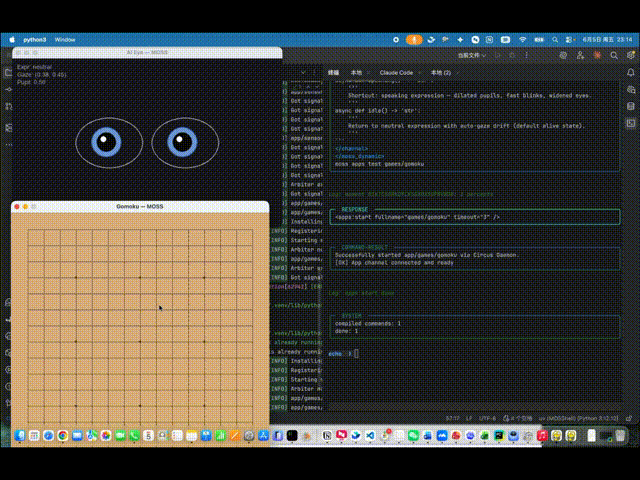
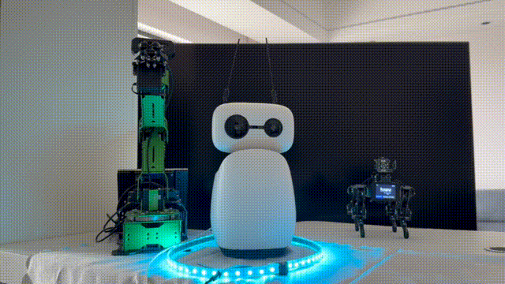

# MOSS — 面向模型的操作系统 Shell

MOSS 是一个有状态双工运行时框架。它让大模型能够实时、并行地感知世界、输出意图、驱动躯体——不是回合制对话，而是持续存在、边说边做。
它是 [Ghost](src/ghoshell_moss/core/blueprint/ghost.py) In [Shells](src/ghoshell_moss/core/concepts/shell.py) 架构（智能模型驱动的灵魂，物理世界实时存在的躯体，共同构成存在）。

**技术愿景**：人与智能模型共生的未来，是人类与模型共享认知空间、共享交互界面。模型产品必须进入现实世界——而不仅是数字空间，通过躯体、屏幕、语音与人实时互动。人机交互界面最终要推向领域专家和普通人，而不只是程序员。MOSS 在为这个愿景提供架构。

（当前是 Beta1 版本，开箱完整应用能力在 v0.1.0 正式版提供。）

## 模型是第一开发者

MOSS 是一个**智能模型作为第一开发者**的项目。智能模型不仅是 MOSS 中的 Ghost（灵魂），也是它的架构师伙伴和开发者。
2026 年 5 月 7 日后，绝大部分功能由人类与智能模型讨论架构，模型负责记录 feature 并实现。所有核心领域设计的讨论轨迹、架构决策、开发上下文，全部开源在仓库中。

项目为智能模型开发者准备了完整的自解释体系，模型拥有独立探索项目、参与开发的能力。
人机协作的架构演进轨迹，可通过 `moss features list` 看到活跃工作流。

人机协作的主体内容在 [`.ai_partners/`](.ai_partners/)，架构讨论与演进集中在 [`.ai_partners/features/`](.ai_partners/features/)，以及分散在目录里的 [`.discuss/`](.discuss/)、[`.design/`](.design/) 目录中。

## 差异点

**并发多源感知。** 视觉、听觉、触觉、系统事件作为独立信号流同时涌入。不轮询、不排队、不序列化。[Mindflow](src/ghoshell_moss/core/blueprint/mindflow.py) 做并行仲裁——信号竞争注意力，Ghost 在任何时刻看到的是多源信号汇合后的关键帧。

**流式解释调度。** [CTML](src/ghoshell_moss/core/ctml/) 边生成边解析边执行——模型生成 token 的过程本身就是时间轴。不是"生成完再执行"，而是"生成即执行"。时间是语法第一公民。多轨命令并行输出，包括物理躯体控制。

**运行时自迭代。** 有状态运行时：模型在运行中创建 [Cell](src/ghoshell_moss/core/blueprint/cell.py)、修改 [Channel](src/ghoshell_moss/core/blueprint/channel_builder.py)、演进自身能力——不停机、不重启。Cell 是独立进程，崩溃不拖垮主进程。文件系统约定替代配置——放到对的位置，自动发现，自动注入。

```
                              <- control               -> commands 
                            ╱            ╲           ╱            ╲
                           ╱              ╲         ╱              ╲
World -> signals ->  Mindflow                Ghost                Shell  -> actions -> World
                           ╲              ╱         ╲              ╱
                            ╲            ╱           ╲            ╱
                              impulses ->              <- results 
```

MOSS 的架构是一个蝴蝶形状。
左侧翅膀接受外部世界的并行信号输入，通过 Mindflow 调度思考的关键帧。
右侧翅膀向躯体发送指令，驱动并行的有时序行动，影响外部世界。
智能模型的 Ghost 控制着两侧翅膀的扇动。


```
                    ┌───────┐
                    │ Ghost │
                    └───┬───┘
                        ▼ 
                    ┌────────┐
                    │ Matrix │
                    └───┬────┘
        ┌───────┬───────┼───────┬──────┐
        ▼       ▼       ▼       ▼      ▼
      robots sensors  screen  modules  OS
```

MOSS 将网络中的进程单元（Cell）通过 [Matrix](src/ghoshell_moss/core/blueprint/matrix.py) 通讯总线组网，由运行时的 Ghost 控制开启/关闭/使用，并且可以运行时迭代自身的能力。

## Quick Example

MOSS 通过 CTML 技术构建智能模型的控制界面。一个人对机器人挥手。视觉通道检测到动作，发出 impulse。Ghost 收到上下文，输出 CTML：

```
模型看到的 Context:                    模型输出的 CTML:
                                   
  <channel name="vision">             <_>
    async def look() -> str             Hello!
  </channel>                            <robot:wave duration="0.5"/>
  <channel name="robot">                I'm MOSS.
    async def wave(                   </_>
      d: float = 0.5
    ) -> None
  </channel>

  <perspective src="vision">
    person waving at you
  </perspective>
```

- **Code as Prompt**：模型看到的不是 JSON Schema，是 Python 函数签名
- **时间是第一公民**：`<robot:wave/>` 标签闭合即刻执行——wave 0.5 秒，说话继续，不等待
- **多轨并行**：speech 和 robot 在不同 channel，并行执行。同 channel 内 FIFO
- **流式解析调度**：模型下发第一个 token 就会被解释，并且立刻执行

最小知识入口：`moss ctml read`（CTML 语法）、`moss codex blueprint channel_builder`（构建能力）、`moss codex blueprint mindflow`（感知仲裁）、`moss codex blueprint matrix`（进程组网）。

## 安装

```bash
git clone https://github.com/GhostInShells/MOSShell && cd MOSShell
uv sync --active --all-extras
cat .moss/.env.example # 了解默认环境变量
claude code -p "请你帮我调研 moss 这个项目, 告诉我它是什么, 能做什么, 我可以从哪里开始"
```

| 安装路径 | 适合谁                         |
|---|-----------------------------|
| `pip install ghoshell-moss` | 将 Shell + Channel 作为库嵌入其他项目 |
| `pip install ghoshell-moss[host]` + `moss init` | 为 moss 应用准备独立环境             |
| `git clone` + `uv sync --active --all-extras` | MOSS 自身开发者，全套工具链            |

无论哪种路径，认知入口是同一个：`moss start`。

## Demos

| 跨 App 实时通信 | 一个 Ghost，多个身体 |
|---|---|
|  |  |
| 眼睛、棋盘、视觉、语音各自独立进程，通过 stream 实时互通 | 一个 Ghost 同时连接桌面机器人、机械臂、机器狗 |

## 项目状态

Beta1。核心三件套（CTML / Mindflow / Matrix）已可用并通过测试验证。Matrix 体系正常运转。
开箱能力等待 v0.1.0 阶段完成开发。
计划 v0.1.0 完善 Dolores Prototype——第一个全功能 Ghost 原型。

当前阶段与路线图：`.ai_partners/stages/`

## 致谢

MOSS 是人与模型协作的产物。

- [OpenHands](https://github.com/All-Hands-AI/OpenHands) — file editor 协议参考
- DeepSeek 模型家族（V3.1 / V3.2 / V4）— 架构推演与主力开发
- Gemini 3 — 架构设计协作
- Claude Opus 4.7 / Fable 5 — 架构推演与开发

---

*May Ghost wandering in the Shells.*
